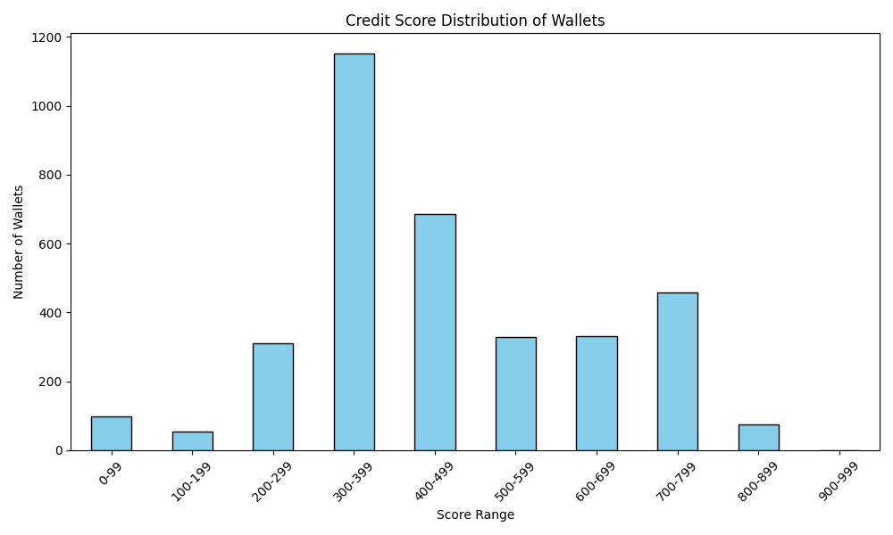

# Wallet Credit Score Analysis

This document provides insights into the behavior of DeFi wallets based on their synthetic credit scores.

## Score Distribution

### Score Ranges and Wallet Counts:
- **0-99**: 97 wallets
- **100-199**: 55 wallets
- **200-299**: 310 wallets
- **300-399**: 1153 wallets
- **400-499**: 687 wallets
- **500-599**: 329 wallets
- **600-699**: 331 wallets
- **700-799**: 459 wallets
- **800-899**: 76 wallets
- **900-999**: 0 wallets

## Behavioral Observations

### Low Score Wallets (0–300):
- Majority have borrowed but **not repaid** or repaid very little.
- Often exhibit **short activity durations** or minimal overall usage.
- Many have **0 deposits** but non-zero borrows, indicating risky behavior.

### Mid Score Wallets (400–700):
- These wallets show **some deposit activity** and moderate repayment behavior.
- Active for medium durations, but may not consistently redeem or repay borrowed funds.
- Represents **average, moderate-risk** participants.

### High Score Wallets (800–1000):
- Frequently **deposit large amounts** and **avoid borrowing altogether**, or borrow and repay in full.
- Exhibit **longer active durations** and often redeem what they deposited.
- Represent **trustworthy, low-risk** DeFi users with strong financial behavior.

## Summary
Synthetic credit scoring using on-chain wallet activity provides a meaningful segmentation of DeFi users. This analysis helps identify high-risk borrowers and reward responsible actors, which can be used for loan approvals, risk stratification, or gamified reputation systems.
